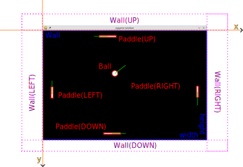

+++

title = "Distributed Pong"
description = "A running example for 'Distributed Systems — Module 2', based on the classic game Pong"
outputs = ["Reveal"]
aliases = [
    "/pong/"
]

+++

# Distributed Pong

{}

---

## What's Pong?

<https://en.wikipedia.org/wiki/Pong>


---

## Goal

In this running example we are going to

- implement a __distributed__ version of the classic game Pong
- in [Python](https://www.python.org)
- using [PyGame](https://www.pygame.org)

in order to exemplify the _development_ of a distributed system _project_.

---

## Spoiler

Here's an overview of the final result:

{}
{}

{}
{}
Source code at: <>

Go on, play with it!

```bash
git clone 
cd dpongpy
# may require pip install -r requirements.txt if poetry is missing
poetry install
poetry run python -m dpongpy --mode local
```

<br>

Default key bindings:
- _Left_ paddle: __WASD__
- _Right_ paddle: __Arrow keys__
{}
{}

---

## What is PyGame?

- **PyGame** is a popular Python library for writing simple games

- It handles many game development tasks, such as _graphics_, _sound_, _time_, and _input management_.

- Simple to use, yet powerful enough to create non-trivial games

- Lightweight, portable, and easy to install
    + `pip install pygame` (better to use a virtual environment)

---

{}



## Preliminaries

# The Game Loop

---

## What is a Game Loop?

- A **game loop** is the main logic cycle of most video-games

- It continuously runs while the game is active, managing the following aspects:
    1. **Processing user input** (e.g., keyboard, mouse, gamepad)
    2. **Updating the game state** (e.g., moving objects in the virtual space)
    3. **Rendering the game** (e.g., drawing the game world on the screen)
    4. **Simulating the passage of time** in the game (e.g., moving objects even in absence of inputs)

- Most commonly, some _wait_ is introduced at the end of each cycle 
    + to control the game's frame rate

---

## The Game Loop in PyGame

{}

full example [on GitHub]()

---

#### Aspects to notice (cf. [PyGame documentation](https://www.pygame.org/docs/ref/event.html)):

- PyGame comes with a notion of _events_ and __event queue__ 
    * this is good for handling user _inputs_

- each event had a _type_ (e.g., `pygame.KEYDOWN` and `pygame.KEYUP`) and _attributes_ (e.g., `event.key`)
    * there is a _class_ for events, namely `pygame.event.Event`
    * event _types_ are indeed `int`egers

- events can be _retrieved_ from the queue (e.g., `pygame.event.get([RELEVANT_TYPES])`)...
    * where `RELEVANT_TYPES` is a _list_ of event _types_ to be retrieved

- ... and possibly _provoked_ (i.e. appended to the queue) by the programmer (e.g., `pygame.event.post(event)`)
    * where `event` is an instance of `pygame.event.Event`

---

## Clean Code Recommendations

1. Better to explicitly represent _game objects_ in the code
    - __Game Object__ $\approx$ any entity that may appear in the game world (e.g. the circle)
        + interesting aspects: _size_, _position_ , _speed_, _name_, etc.
        + may have methods to _update_ its state
    - the _overall_ **game state** consists of _all_ game objects therein contained
        + $\Rightarrow$ update the game $\equiv$ update _each_ game objects
    - cf. [PyGame documentation](https://www.pygame.org/docs/)

{}
{}
{}
{}
{}


class GameObject {
    + name: str
    + position: Vector2
    + size: Vector2
    + speed: Vector2
    + bounding_box: Rect
    + update(dt: float)
}

package "pygame" {
    class Vector2 {
        + x: float
        + y: float
    }
    class Rect {
        + left: float
        + top: float
        + width: float
        + height: float
    }
}

GameObject *-d- Vector2
GameObject *-- Rect


{}
{}


full example [on GitHub]()

---


## Clean Code Recommendations

2. Better to explicitly represent _input handlers_ and _controllers_ in the code
    - __Input Handler__ $\approx$ any entity that may _interpret_ user inputs and map them to _game events_
        + supports plugging in different _key maps_
    - __Game Events__ $\approx$ represent _actions_ that make sense for game objects
        + e.g., `MOVE_UP`, `MOVE_DOWN`, `STOP`, etc.
        + custom event _types_ can be defined via [`pygame.event.custom_type()`](https://www.pygame.org/docs/ref/event.html#pygame.event.custom_type)
    - __Controller__ $\approx$ any entity that may _interpret_ game events and _update_ the game state accordingly

{}
{}
{}
{}
{}


top to bottom direction

enum GameEvent {
    + MOVE_UP
    + MOVE_DOWN
    + MOVE_LEFT
    + MOVE_RIGHT
    + STOP
    + create_event(**kwargs): Event
    + {static} all(): set[GameEvent]
    + {static} types(): list[int]
}

package "pygame" {
    package "event" {
        class Event {
            + type: int
            + data: dict
        }
    }
}

class InputHandler {
    + keymap: Dict[int, int]
    + handle_inputs() -> List[int]
    + post_event(event: Event)
}

class Controller {
    - _game_object: GameObject
    - _speed: float
    + update(dt: float)
    - _update_object_according_to_event(game_object, event)
}

InputHandler <|-d- Controller

InputHandler .u.> GameEvent: uses
InputHandler .u.> Event: uses


{}
{}

full example [on GitHub]()

---

## Clean Code Recommendations

3. Better to delegate _rendering_ to a dedicated class taking care of the _view_ of the game
    - __View__ $\approx$ any entity that may _draw_ game objects on the screen
        + may have methods to _render_ the game (objects) on the screen
    - cf. [PyGame documentation](https://www.pygame.org/docs/ref/display.html)

{}
{}
{}
{}
{}


top to bottom direction

class View {
    - _size: tuple[int, int]
    - _screen: Surface
    + background_color: Color
    + foreground_color: Color
    - _game_object: GameObject
    + render()
    - _reset_screen(screen, color)
    - _draw_game_object(game_object, color)
}

package "pygame" {
    class Surface {
        + fill(color: Color)
        + flip()
    }
    class Color {
        + r: int
        + g: int
        + b: int
        + a: int
    }
}

View .d.> Surface: uses
View ..> Color: uses


{}
{}

full example [on GitHub]()

---

## Clean Code Recommendations

4. Wrap up
    - game loop is now much simplified
    - changes in _input handling_ $\rightarrow$ implement new `InputHandler`
    - changes in _game logic_ $\rightarrow$ implement new `Controller`
    - changes in _visualization_ $\rightarrow$ implement new `View`

{}

full example [on GitHub]()

{}

---

{}



# Pong Model

---

## Let's infer a model from the view (pt. 1)


- up to 4 _paddles_ for as many __players__
- a _ball_ that _bounces off_ the paddles and the _walls_

---

## Let's infer a model from the view (pt. 2)

{}
{}

{}
{}
<br>

`Pong` game model comprehends:
1. `GameObject`: _visible_ entity in the game
    - relevant properties: `name`, `position`, `size`, \*`speed`\*, `bounding_box`
        * `position`, `size`, and \*`speed`\* are `Vector2` instances
    - particular cases: `Paddle`, `Ball`
        * `Paddle` instances are assigned to one `side` (_property_) of the screen
            + 4 possible _sides_ for as many `Direction`s: `UP`, `DOWN`, `LEFT`, `RIGHT`
            + each paddle corresponds to a different _player_
                - to support _local_ **multiplayer**, different _key bindings_ are needed
2. `Board`: the plane upon which the game is played (black _rectangle_ in the figure)
    - relevant properties: `size`, `walls`
    - `Wall`: _invisible_ entity that _reflects_ the `Ball` when hit

3. Ancillary classes: `Vector2`, `Rectangle`, `Direction`
    - `Vector2` _utility_ class from PyGame, representing a _2D vector_
    - `Rectangle` _utility_ class, representing a _rectangle_, supporting __collision detection__
    - `Direction` is an _enumeration_ of 4 possible directions + `NONE` (lack of direction)
{}
{}

---

## Let's infer a model from the view (pt. 3)



left to right direction

package "dpongpy.model" { 

    enum Direction {
        + {static} NONE
        + {static} LEFT
        + {static} UP
        + {static} RIGHT
        + {static} DOWN
        --
        + is_vertical: bool
        + is_horizontal: bool
        + {static} values(): list[Direction]
    }

    interface Sized {
        +size: Vector2
        +width: float
        +height: float
    }

    interface Positioned {
        +position: Vector2
        +x: float
        +y: float
    }

    class Rectangle {
        + top_left: Vector2
        + top_right: Vector2
        + bottom_right: Vector2
        + bottom_left: Vector2
        + top: float
        + bottom: float
        + left: float
        + right: float
        + corners -> list[Vector2]
        + overlaps(other: Rectangle) -> bool
        + is_inside(other: Rectangle) -> bool
        + intersection_with(other: Rectangle) -> Rectangle
        + hits(other: Rectangle) -> dict[Direction, float]
    }

    Rectangle --|> Sized
    Rectangle --|> Positioned

    class GameObject {
        + name: str
        + speed: Vector2
        + bounding_box: Rectangle
        + update(dt: float)
        + override(other: GameObject)
    }

    GameObject --|> Sized
    GameObject --|> Positioned
    GameObject "1" *-- "1" Rectangle

    class Paddle {
        + side: Direction
    }

    Paddle --|> GameObject
    Paddle "1" *-- "1" Direction

    class Ball
    Ball --|> GameObject

    class Board {
        + walls: dict[Direction, GameObject]
    }

    Board --|> Sized
    Board "1" *-- "4" Direction
    Board "1" *-- "4" GameObject

    class Pong {
        + config: Config
        + random: Random
        + ball: Ball
        + paddles: list[Paddle]
        + board: Board
        + updates: int
        + time: float
        --
        + reset_ball(speed: Vector2 = None)
        + add_paddle(side: Direction, paddle: Paddle = None)
        + paddle(side: Direction): Paddle
        + has_paddle(side: Direction): bool
        + remove_paddle(self, Direction)
        --
        + update(dt: float)
        + move_paddle(paddle: int|Direction, direction: Direction)
        + stop_paddle(paddle: int|Direction):
        + override(self, other: Pong):
        - _handle_collisions(subject, objects)
    }

    'Pong --|> Sized
    Pong "1" *-- "1" Ball
    Pong "1" *-- "4" Paddle
    Pong "1" *-- "1" Board
    Pong "1" *-- "1" Config

    note top of Pong
        model class
    end note

    class Config {
        + paddle_ratio: Vector2
        + ball_ratio: float
        + ball_speed_ratio: float
        + paddle_speed_ratio: float
        + paddle_padding: float
    }
}

package "random" {
    class Random {
        + uniform(a: float, b: float): float
    }
}

package "pygame" {
    class Vector2 {
        +x: float
        +y: float
    }
}

Rectangle "1" *-l- "6" Vector2
Pong "1" *-- "1" Random



code [on GitHub]()


---

## Let's infer a model from the view (pt. 4)

Facilities of the `Pong` class, to __configure__ the game:
- `reset_ball(speed=None)`: _re-locates_ the `Ball` at the _center_ of the `Board`, setting its `speed` _vector_ to the given value 
    + _random_ speed _direction_ is provided if `speed` is `None`
- `add_paddle(side, paddle=None)`: _assigns_ a `Paddle` to the `Pong`, at the given `side` (if not already present)
    + the `Paddle` is created from scratch if `paddle` is `None`
        * in this case, the paddle is _centered_ on the `side` of the `Board`
- `paddle(side)`: _retrieves_ the `Paddle` at the given `side`
- `has_paddle(side)`: _checks_ if a `Paddle` is present at the given `side`
- `remove_paddle(side)`: _removes_ the `Paddle` at the given `side`

Facilities of the `Pong` class, to __animate__ the game:
- `update(dt)`: _updates_ the game state, _moving_ the `Ball` and the `Paddles` according to the given time _delta_
    + computes _collisions_ between the `Ball` and the `Paddles` and the `Walls`
        * uses `_handle_collisions` method to the purpose
- `move_paddle(side, direction)`: _moves_ the selected `Paddle` in the given `direction` by setting its `speed` _vector_ accordingly
    + `paddle` can either be an `int` (index of the `Paddle` in the `paddles` list) or a `Direction` (side of the `Paddle`)
    + _left_ and _right_ paddles can only move _up_ and _down_, respectively
    + _up_ and _down_ paddles can only move _left_ and _right_, respectively
- `stop_paddle(side)`: _stops_ the selected `Paddle` from moving

--- 

## About collisions

- _Collision detection_ is a crucial aspect of game development
    + it is the process of _determining_ when two or more game objects _overlap_
    + it is the basis for _physics simulation_ in games

- In `Pong` collisions are very _simple_, as they simply rely on the game objects' __bounding boxes__
    + a _bounding box_ the __minimal__ _rectangle_ that _encloses_ the game object
    + a collision is detected when two bounding boxes _overlap_

- In `Pong` there are 3 sorts of relevant collisions:
    1. `Ball` vs. `Paddle`
    2. `Ball` vs. `Wall`
    3. `Paddle` vs. `Wall`

- __Bouncing__ can simply be achieved by _reversing_ the `Ball`'s speed _vector_ along the _colliding_ axis

---

## Collision detection in `GameObject`s (non overlapping)


---

## Collision detection in `GameObject`s (overlapping)


---

## Collision detection in `GameObject`s (inside)


---

## Bouncing

1. Suppose the `Ball` is close to an obstacle and `update()` is called


---

## Bouncing

2. When the position of the `Ball` is updated, it is now _overlapping_ an obstacle (wall, or paddle)


---

## Bouncing

3. `Bouncing` = _reversing_ the speed vector along the _colliding_ axis + re-locating the `Ball` outside the obstacle


---

## Bouncing

3. Another `update()` call will _move_ the `Ball` _away_ from the obstacle


{}

<!-- Maybe discuss sizing? -->

---

{}



# Pong I/O

---

## Input handling and Control (pt. 1)

In the general case, `Paddle`s are moved by players, via the _keyboard_
+ when players are __distributed__, the _keyboards_ are __different__
    * so __key bindings__ _can_ be the _same_ for all players (but still _customisable_)

+ when players are __local__, there's only __one__ keyboard
    * so __key bindings__ _must_ be _different_ for each player

---

## Input handling and Control (pt. 2)



left to right direction

package "pygame.event" {
    class Event {
        + type: int
        + dict: dict
    }
}

package "dpongpy.controller" {
    class ActionMap {
        + move_up: int
        + move_down: int
        + move_left: int
        + move_right: int
        + quit: int
        + name: str
    }

    enum PlayerAction {
        + {static} MOVE_UP
        + {static} MOVE_DOWN
        + {static} MOVE_RIGHT
        + {static} MOVE_LEFT
        + {static} STOP
        + {static} QUIT
    }

    enum ControlEvent {
        + {static} PLAYER_JOIN
        + {static} PLAYER_LEAVE
        + {static} GAME_START
        + {static} GAME_OVER
        + {static} PADDLE_MOVE
        + {static} TIME_ELAPSED
    }

    interface InputHandler {
        + create_event(event, **kwargs)
        + post_event(event, **kwargs)
        ..
        + key_pressed(key: int)
        + key_released(key: int)
        + time_elapsed(dt: float)
        ..
        + handle_inputs(dt: float)
    }

    interface EventHandler {
        + handle_events()
        ..
        + on_player_join(pong: Pong, paddle):
        + on_player_leave(pong: Pong, paddle):
        + on_game_start(pong: Pong):
        + on_game_over(pong: Pong):
        + on_paddle_move(pong: Pong, paddle, direction):
        + on_time_elapsed(pong: Pong, dt):
    }
}

package "dpongpy.model" {
    class Pong {
        stuff
    }
}

ActionMap <.. InputHandler: processes
Event <.. InputHandler: processes
InputHandler ..> PlayerAction: selects\nbased on\nActionMap\nand\nEvent
InputHandler ..> ControlEvent: generates
PlayerAction <.. ControlEvent: wraps
ControlEvent <.. EventHandler: processes
EventHandler ..> Pong: updates\nbased on\nControlEvent




+ each __player__ is associated to a `Paddle` and to an `ActionMap` to _govern_ that `Paddle`
+ an `ActionMap` is a _dictionary_ mapping _key codes_ to `PlayerAction`s
    * e.g. `pygame.K_UP` $\rightarrow$ `MOVE_UP`, `pygame.K_DOWN` $\rightarrow$ `MOVE_DOWN` for _right_ paddle (arrow keys)
    * e.g. `pygame.K_w` $\rightarrow$ `MOVE_UP`, `pygame.K_s` $\rightarrow$ `MOVE_DOWN` for _left_ paddle (WASD keys)
+ `PlayerAction`s are one particular _sort_ of `ControlEvent`s that may occur in the game
    * e.g. `GAME_START`, `PADDLE_MOVE`, `TIME_ELAPSED`, etc.
+ `ControlEvent`s are _custom_ PyGame events which _animate_ the game
    * each event instance is _parametric_ (i.e. may carry additional _data_)
        * e.g. `PADDLE_MOVE` carries the information about _which_ `Paddle` is moving and _where_ it is moving


---

## Rendering

{}

---

{}



## Distributed Pong Architecture


{}

---

{}



## Distributed Pong Protocols


{}

---

{}



## Distributed Pong Analysis


{}